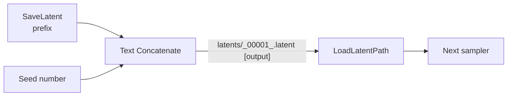

<div align="center">

# ComfyUI-LoadLatentPath

**Load a `.latent` file from a plain STRING path — linkable, no validation crash.**

[](./LICENSE)
[](https://github.com/comfyanonymous/ComfyUI)


A drop-in replacement for the built-in ComfyUI **LoadLatent** node.
The built-in node uses a combo dropdown for its file picker and crashes at
validation time if its latent input comes from a link — because its
`VALIDATE_INPUTS` method cannot resolve linked combo values yet.

This node takes a plain STRING path you can wire from `Text Concatenate` or
any other node, and intentionally skips `VALIDATE_INPUTS`, so linked inputs
never crash.

[Install](#install) · [Usage](#usage) · [Why](#why-this-exists) · [License](#license)

</div>

---

## At a glance

|                              | Built-in `LoadLatent` | `LoadLatentPath` |
| ---------------------------- | --------------------- | ---------------- |
| Path input type              | Combo dropdown        | **STRING**       |
| Works with linked inputs     | Crashes on validation | **Works**        |
| Supports `[output]` / `[input]` annotations | No | **Yes** |
| Loads to CPU (no VRAM fight) | n/a                   | **Yes**          |
| Extra dependencies           | None                  | None             |

---

## Install

### A — ComfyUI Manager (recommended)

Search **"LoadLatentPath"** in Manager and click **Install**.

### B — git clone

```bash
cd ComfyUI/custom_nodes
git clone https://github.com/<YOUR_GITHUB_USERNAME>/ComfyUI-LoadLatentPath.git
```

No `requirements.txt` step — the node only uses `folder_paths` and
`safetensors.torch`, both already shipped with ComfyUI.

### C — Manual

1. Download the latest release ZIP.
2. Unzip into `ComfyUI/custom_nodes/ComfyUI-LoadLatentPath/`.
3. Restart ComfyUI.

> Always restart ComfyUI after installing a custom node.

---

## Usage

After restart, find the node under the **model/latent** category →
**"Load Latent from Path"**.

### Inputs

| Name  | Type   | Description                                                                                                  |
| ----- | ------ | ------------------------------------------------------------------------------------------------------------ |
| path  | STRING | Path to a `.latent` file. Supports `[output]` / `[input]` / `[temp]` annotations, e.g. `latents/xxx.latent [output]`. |

### Outputs

| Name    | Type    | Description                                                            |
| ------- | ------- | ---------------------------------------------------------------------- |
| LATENT  | LATENT  | Standard latent tensor, ready for `KSampler`, `LatentUpscaleBy`, etc.  |

### The canonical pattern



```text
[SaveLatent prefix] --\
                      [Text Concatenate] --> [LoadLatentPath] --> [KSampler]
[seed number] ------/                          (path = "latents/<prefix><seed>_00001_.latent [output]")
```

This is the bread-and-butter pattern for **two-pass / split-sampling
workflows**: pass 2 reads back the latent that pass 1 saved, by matching on
`(prefix, seed)` — no manual file picking.

---

## Why this exists

The built-in `LoadLatent` node uses a combo dropdown for its file picker. To
get a path string that can be linked from another node, you normally need a
custom node. But if you wire a link INTO the built-in `LoadLatent` itself, it
crashes at validation time because its `VALIDATE_INPUTS` method cannot
resolve linked combo values yet.

This node solves both problems at once:

1. It takes a **STRING** path (linkable from any text-producing node).
2. It **skips `VALIDATE_INPUTS`**, so linked inputs never crash.

Result: it works exactly the way a sane load-by-path node should have worked
all along.

---

## Compatibility

- ComfyUI portable / desktop / manual installs
- Python 3.10+ (whatever ComfyUI ships with)
- Works with or without a GPU present — the tensor is loaded to CPU
- Tested with latent tensors produced by the built-in `SaveLatent`
  (format `latent_format_version_0`); older latent files are auto-rescaled

---

## Limitations

- **Not a combo picker.** It expects a fully resolved path string; if you
  want a dropdown of available latents, stick with the built-in
  `LoadLatent`.
- **No path validation.** If the file does not exist, the node throws at
  runtime. Wrap in a `try` if your workflow conditionally skips pass 2.

---

## Development

The node is intentionally small — two files:

```
ComfyUI-LoadLatentPath/
├── __init__.py            # exposes NODE_CLASS_MAPPINGS
├── load_latent_path.py    # the actual node
├── .gitignore
└── README.md
```

To sanity-check the module:

```bash
cd ComfyUI-LoadLatentPath
python -c "import ast; ast.parse(open('load_latent_path.py').read())"
```

---

## Credits

- Built for the ComfyUI community
- Inspired by repeated user requests for a linkable latent loader

---

## License

[MIT](./LICENSE) — Copyright (c) 2026 <YOUR_NAME_OR_GITHUB_USERNAME>
